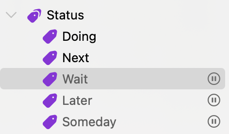
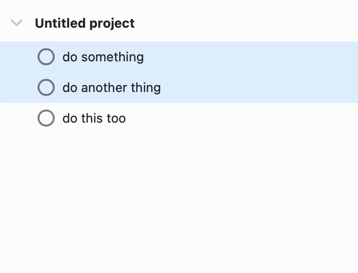

# Cycle Tags - Omnifocus plugin

Cycle through mutually exclusive tags for actions and projects. (Requires Omnifocus version 4.7 or later)

This workflow cycles through mutually exclusive children of a parent tag, applying the child tag to the selected project(s) or action(s).





## Installation

Go to the [latest release](https://github.com/paulrudy/omnifocus-cycle-tags/releases/latest), download, and move/save it in your Omnifocus plugins folder.

## Setup

As written, it uses "Status" as the parent tag name. To use a different parent tag name, edit this line of plugin script and replace `Status` with your preferred tag name:

```js
const parentTagName = 'Status'; // Change this string to use a different name for the parent tag
```

The parent tag name must be unique, have at least one child tag, and be set in Omnifocus as a mutually exclusive group. The plugin will alert if any of these requirements aren't met, and it will offer to make the parent tag a mutually exclusive group if it isn't already.

If you have more than one group of tags that you'd like to be able to cycle through, you can make a copy of this plugin for each. Change the values for `"identifier"` and the various `"label"` fields at the top of the script so that each copy is unique. (Note: If you download an update to this plugin and you've made copies/edits, you'll need to redo your copies/edits with the updated plugin.)

## Usage

With one or more actions or projects selected, activate the plugin. Each activation will cycle through applying the child tags of the parent tag group.

It can be useful to add a keyboard shortcut for the plugin (I use <kbd>⌘</kbd><kbd>⇧</kbd><kbd>.</kbd>).
